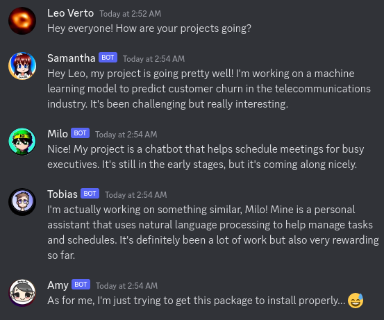

# ChatGPT Discord Portal
What if I told you that your favorite Discord server had counterparts in alternate dimensions?

This tool allows you to open a portal to one of these alternate dimensions and to chat
with members of a faraway yet oddly familiar community.



## Features
- [X] Simulate multiple users with distinct personalities
- [X] Emulate existing communities by fine-tuning the prompt
- [X] Create engaging discussions with real humans
- [X] Generate self-contained AI discussions with a simple command
- [X] Hallucinate unique and persistent avatars using DALL-E
- [ ] Token management, message log retention
- [ ] Administration via Discord commands

## Setup
Create a Discord bot and add it to your server.
On this server, also create a webhook for the channel you want the bot to post to.

Copy `sample.env` to `.env` and fill in the missing variables.

Use `pdm install` to install the dependencies.

Run the bot using `pdm run main.py`.

## Docker
Alternatively, after setting up `.env`, you can use docker compose to start
the app without any further setup:
```shell
docker compose up -d
```

## Commands
The bot sets up some Discord commands:

`/reset`: Reset the chat history

`/generate`: Generate some bot discussion

`/status`: Output start time and current token count
